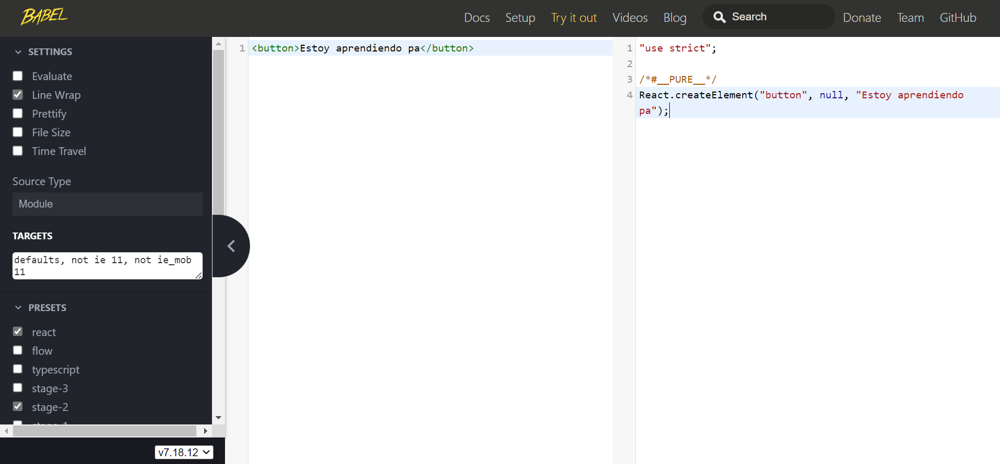

# ¿Que es JSX?
Parece código HTML, pero no es HTML, si no que es JavaScript.
[Babel](https://babeljs.io/), traduce el código JavaScript a código que un navegador entienda muy bien, es un compilador o transpilador, entiende JSX.

**Parece HTML, pero no es así, es JavaScript, tampoco es un string**
Después de compilarse, JSX se convierte en llamadas a funciones JavaScript regulares y se evaluan en objetos JavaScript.
JSX ayuda a prevenir vulnerabilidades,[Cross-Site scripting(Estudiar luego)]([Cross-site scripting - Wikipedia, la enciclopedia libre](https://es.wikipedia.org/wiki/Cross-site_scripting)) ,  ya que no se pueda insertar nada que no este explicitamente escrita en nuestra apilicacion.

### Palabras:
> Compilar: es generar código ejecutable por una máquina, fisica o abstracta.
> 
> Compilador: Traduce un programa escrito en lenguaje de programación de alto nivel como C o C++, en lenguaje máquina.
> 
> Transpilar: es generar código a partir de código en un lenguaje código en otro lenguaje, es decir que un programa crea otro programa en otro lenguaje cuyo comportamiento es el mismo que el original, solo que en otro lenguaje.
 

